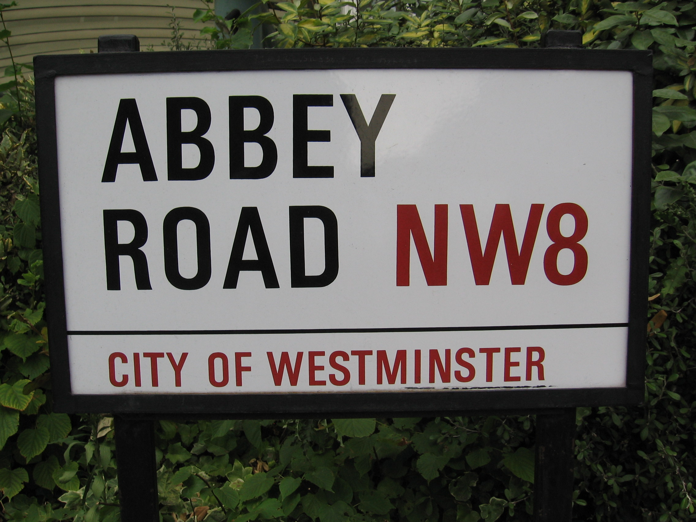

# read-me

It's an optical character recognition (ocr) web service.  Send it images, it will send you back any text it can find in there.

## Deployment

You can deploy it with Docker

    docker build -t docker/read-me .

    docker run -p 50000:8080 -d docker/read-me

Alternatively, just run it up with:

    npm install

    node app.js

## Tests

Run the test with `mocha`

## Using it

### request

Post an image to the service, like this one: 

    curl -i -F image=@test/testfiles/abbey_road.jpg http://localhost:8080/ocr

### response

    HTTP/1.1 200 OK
    X-Powered-By: Express
    Content-Type: text/html; charset=utf-8
    Content-Length: 28
    Date: Sat, 18 Jan 2014 18:50:44 GMT
    Connection: keep-alive

      ABBEY
      ROAD NW8

